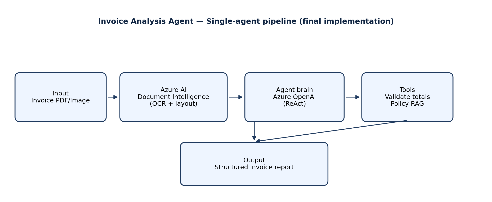

# Invoice Analysis Agent

Single-agent assistant that OCRs an invoice with **Azure AI Document Intelligence**, reasons with **Azure OpenAI**, validates totals with a rules tool, and pulls **policy context via BM25 retrieval (RAG)**—then returns a structured AP-friendly report.

## Team

Team DK — **Dat Dang Nguyen and Khanh Huynh** (implementation / integration).  


## Problem and users

Small and midsize finance teams still spend large amounts of time manually transcribing invoices into accounting systems, which is slow and error-prone. This agent targets **accountants, AP clerks, and owners** who need faster first-pass extraction plus lightweight validation and narrative summarization.

## Option chosen

**Option A: Single AI Agent** (matches the midterm plan; no switch to multi-agent).

## Architecture

The workflow is intentionally linear: **file → OCR → LLM (ReAct) → tools → report**, with **short-term conversational memory** via a LangGraph checkpointer (thread id).



## Frameworks and tools

- **LangGraph** (`create_react_agent`) for a **ReAct** tool-calling loop  
- **LangChain** (messages, tools, community retrievers)  
- **Azure OpenAI** (chat / reasoning)  
- **Azure AI Document Intelligence** (`prebuilt-invoice`)  
- **BM25 lexical retrieval** over markdown policy docs in `data/knowledge/` (RAG)  
- **Python 3.10+** (developed/tested on **Python 3.11+** recommended)

## Installation

1. **Install Python**  
   Use **Python 3.10 or newer** (3.11+ recommended).

2. **Create a virtual environment (recommended)**

```bash
python -m venv venv
```

Windows PowerShell:

```powershell
.\venv\Scripts\Activate.ps1
```

macOS/Linux:

```bash
source venv/bin/activate
```

3. **Install dependencies**

```bash
pip install -r requirements.txt
```

4. **Configure environment variables**

Copy the template and fill in your Azure values:

```bash
copy .env.example .env
```

PowerShell uses `copy`; macOS/Linux use `cp`.

Edit `.env` (never commit real keys):

- `AZURE_OPENAI_API_KEY`
- `AZURE_OPENAI_ENDPOINT` (like `https://YOUR_RESOURCE.openai.azure.com`)
- `AZURE_OPENAI_CHAT_DEPLOYMENT_NAME` (your chat deployment name)
- `AZURE_OPENAI_API_VERSION` (default in `.env.example` is usually fine)
- `AZURE_DOCUMENT_INTELLIGENCE_ENDPOINT`
- `AZURE_DOCUMENT_INTELLIGENCE_KEY`

5. **(Optional) Regenerate the architecture image**

```bash
python scripts/generate_architecture_png.py
```

## How to run the agent

From the repository root (with your venv activated):

```bash
python main.py --invoice PATH_TO_INVOICE.pdf
```

Equivalent alternate entrypoint:

```bash
python run_agent.py --invoice PATH_TO_INVOICE.pdf
```

### Multi-turn memory (optional)

Use the same `--thread-id` across runs to continue a conversation in-process:

```bash
python main.py --invoice data/sample_invoices/sample.pdf --thread-id ap-session-1
```

## Example usage (what to expect)

> Note: exact OCR fields depend on the invoice layout and model output.

### Example 1 — Standard vendor PDF

**Input**

```bash
python main.py --invoice data/sample_invoices/contoso_sample.pdf
```

**Output (shape)**

- `Summary` bullets (vendor, invoice id/date, total)
- `Key Fields` extracted from OCR JSON
- `Validation` results from the totals tool (PASS/FAIL with reasons)
- `Policy Notes` only when the policy retriever returns relevant excerpts

### Example 2 — Same thread follow-up question

**Input**

```bash
python main.py --invoice data/sample_invoices/contoso_sample.pdf --thread-id demo-1 --message "What looks risky for duplicate payment?"
```

**Output (shape)**

- Adds `Risks/Anomalies` style guidance grounded in tool outputs + retrieved policy snippets

### Example 3 — Extra AP instructions

**Input**

```bash
python main.py --invoice ./invoices/INV-2044.png --message "Flag missing tax fields explicitly."
```

**Output (shape)**

- Same structured report, with explicit callouts if `TotalTax` / tax-related fields are absent

## Knowledge base (RAG sources)

Synthetic policy markdown lives in:

- `data/knowledge/validation_tolerances.md`
- `data/knowledge/required_fields.md`
- `data/knowledge/fraud_and_duplicates.md`

These are **not** proprietary data; they exist so reviewers can see what the retriever is grounded on.

## Known limitations

- Requires **working Azure credentials** for both **Document Intelligence** and **Azure OpenAI** chat.  
- OCR quality depends on scan quality, rotation, and layout; some invoices will have missing fields.  
- The totals validator is a **deterministic heuristic** (not a full accounting engine) and may be inconclusive when tax/subtotal fields are absent.  
- Conversation memory uses an **in-memory checkpointer** (`MemorySaver`): it helps multi-turn demos, but it is **not** durable across process restarts.  
- No automatic ERP posting (export/reporting only).

## Demo video

(https://www.loom.com/share/30e0d9aa1c9b434eb3b7266c8db71c4e)

## Repository layout

- `main.py`, `run_agent.py` — CLI entrypoints  
- `src/agent.py` — LangGraph ReAct agent wiring  
- `src/tools.py` — OCR tool, totals tool, policy search tool  
- `src/memory.py` — BM25 retriever + checkpointer factory  
- `src/di_client.py` — Document Intelligence client wrapper  
- `data/knowledge/` — RAG corpus  
- `architecture.png` — embedded architecture diagram  

## Security note

Never commit `.env` or real API keys. This template uses `.gitignore` to exclude `.env`.
